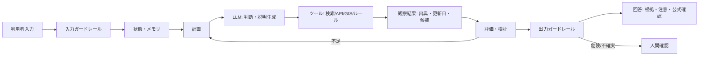

# 第4回 AIエージェントの基本概念

## 1. 今日の目的
- AIエージェントをLLMチャットではなく、外部情報・ツール・状態・評価を含むシステムとして考える
- LLM、ツール、メモリ、状態、計画、実行、評価、ガードレールの関係を図示する
- 避難所案内エージェントを紙上設計する
- 疑似コードと失敗パターンを記録する

## 2. 第3回からの接続
- 第3回で扱ったタスク：台風時の高齢者向け避難判断の説明（プロンプト改善の実験）
- プロンプトだけでは足りないと思った点：避難所の開設状況や公式資料の更新日など、動的で地域固有の情報はプロンプトをいくら工夫しても取得できず、最新性を担保できない点
- 外部情報やツールが必要だと思った場面：避難所の検索、自治体・気象庁の公式ページ確認、利用者条件に合わせた候補の条件フィルタリング

## 3. AIエージェント構成図
- 想定利用者：高齢者と支援者
- 想定場面：台風接近時の避難判断
- 入力：地区名・利用者条件・災害種別
- 出力：候補避難所・根拠・注意・公式確認の促し
- LLMの役割：取得した候補と注意点を、高齢者にも分かりやすい説明文として生成する
- ツールの役割：避難所検索・公式確認・条件フィルタの実行（外部情報の取得）
- メモリ・状態として保持するもの：地区・利用者条件・災害種別・試行回数・出典リスト
- 評価観点：根拠の有無・断定回避・安全性
- ガードレール：個人情報の遮断（最小入力への誘導）と断定表現の回避

## 4. 避難所案内エージェントの紙上設計
| 項目 | 内容 |
|---|---|
| 利用者条件 | 高齢者と支援者。地区・利用者条件・災害種別を最小限の入力として受け取る |
| 必要な外部情報 | 避難所の開設状況・住所・更新日・出典 |
| 使うツール | 避難所検索ツール・公式確認ツール・条件フィルタツール |
| 公式情報確認の方法 | 自治体や気象庁の公式サイトと照合し、更新日と出典を確認する |
| 回答で避けるべき表現 | 「必ず安全」などの断定、更新日未確認のままの情報提示 |
| 人間確認が必要な場面 | 公式情報が取得できず、生命に関わる危険な場面 |

## 5. 疑似コード
ペア（竹内新）と作成した避難所案内エージェントの疑似コード。

- ペアで合意した改善点：出典と更新日を必ず出力に含める。取得失敗時は最大2回までで安全停止し、人間確認へ回す。

## 6. 失敗パターンと対策
| 失敗パターン | なぜ危険か | 対策・ガードレール |
|---|---|---|
| 古い避難所開設情報を使う | 実際には閉鎖中の施設を案内する恐れ | 更新日・公式情報・取得時刻を必ず表示する |
| 利用者の住所や配慮情報をLLMへ送る | 個人情報・要配慮情報の漏えい | 地区名など最小限の情報に丸める |
| 「ここへ避難すれば安全」と断定する | 防災判断を過度に代替する | 注意喚起と公式確認を併記し、人間確認条件を置く |
| 近さだけを優先して浸水区域の施設を案内する | 災害種別を無視し、被災しうる施設へ誘導する恐れ | 災害種別とハザード情報を別ツールで確認し、浸水区域を候補から除外する |

## 7. ペアレビューで得たコメント
ペア相手：竹内新（相互レビュー）
- 良い点：ツール失敗時に処理を停止し、人間確認へ回す設計の流れが明確だった
- 気になる点：避難所の更新日確認の手順が曖昧で、浸水区域を除外する手順も弱かった
- 改善案：災害種別とハザード情報を別ツールで確認し、出典と更新日を必ず出力に含める

## 8. 第5回への接続
- function calling やツール利用で実装してみたい処理：避難所検索APIとハザード確認をfunction callingで実装し、取得した出典・更新日を必ず出力に含める処理
- プログラムで確定的に処理すべき部分：個人情報・APIキーの検知と遮断、利用者条件による候補のフィルタリング、出典・更新日の確認、最大試行回数の制御、ログ記録、取得失敗時の安全停止
- LLMに任せる部分：取得済みの候補避難所と注意点を、高齢者にも分かりやすい説明文として生成する部分

## 9. 注意
- 実際の災害時の判断には、自治体・気象庁等の公式情報を確認すること。
- LLMの回答をそのまま防災判断に使わないこと。
- APIキー、個人情報、非公開情報を記録しないこと。
- `.env` はGitHubに上げない。`.env.example` には実際のキーを書かないこと。
